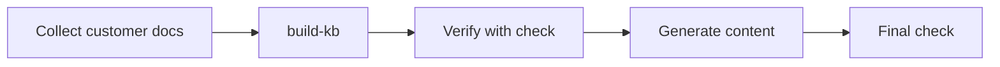
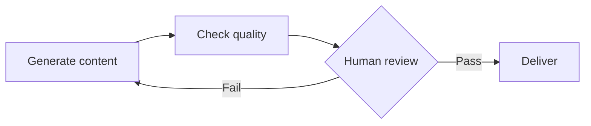

# Doc Solution System - AI Agent Usage Guide

> AI Agent: Read this first to understand how to call system capabilities.

---

## System Overview

| Property | Value |
|----------|-------|
| Type | Document development toolkit |
| Delivery | CLI (Phase 1) + MCP (Phase 2) |
| Python | 3.6+ compatible |
| Dependencies | click, pyyaml, jinja2 (all pre-installed) |
| Network | Zero network required |
| Vale | Optional, bundled at `knowledge/vale.exe` |
| Tests | 39 passing (pytest) |

## Workflow

### New Customer Onboarding



### Daily Operations



## CLI Command Reference

### check

Run quality checks on documents.

```bash
doc-solution check --target <path> [options]
```

| Option | Type | Required | Default | Description |
|--------|------|----------|---------|-------------|
| `--target, -t` | string | yes | - | File or directory path |
| `--check-type, -c` | enum | no | `all` | `all`, `structure`, `format`, `style` |
| `--output, -o` | enum | no | `text` | `text`, `json` |
| `--vale-bin` | string | no | `vale` | Vale binary path (auto-detects bundled) |
| `--config` | string | no | - | Vale .vale.ini path |
| `--save-report` | string | no | - | Save JSON report to file |

**Check types:**

| Type | Vale Needed | Built-in Checks |
|------|------------|-----------------|
| `structure` | No | Heading hierarchy, required sections |
| `format` | Optional | Paragraph length, code block language |
| `style` | Yes (optional) | Terminology, conventions |
| `all` | Optional | Everything above |

**Exit codes:** 0 = no errors, 1 = errors found

**JSON output format:**

```json
{
  "metadata": {"check_id": "check-...", "check_type": "structure", "target": "./docs/"},
  "summary": {"total": 3, "passed": 0, "failed": 1, "warnings": 2, "score": 70.0},
  "details": [{"rule_id": "heading-level", "severity": "error", "message": "...", "file": "...", "line": 1}],
  "trace": [{"step": "StructureCheck", "tool": "md_parser", "status": "completed"}]
}
```

### generate

Generate document content from Jinja2 templates.

```bash
doc-solution generate --template <name> --params '<json>' [options]
```

| Option | Type | Required | Default | Description |
|--------|------|----------|---------|-------------|
| `--template, -t` | string | yes | - | Template name or path |
| `--params, -p` | string | no | `{}` | JSON template parameters |
| `--template-dir` | string | no | `knowledge/templates` | Template directory |
| `--output, -o` | string | no | stdout | Output file path |
| `--auto-check` | flag | no | true | Auto quality check |

**Template resolution:**
1. If `--template` is a file path, use directly
2. If it matches a directory in `--template-dir`, use `.j2` file inside
3. Otherwise, append `.md.j2` and search in `--template-dir`

**Built-in templates:**

| Name | Description | Key Params |
|------|-------------|------------|
| `api-ref` | API reference | api_name, declaration, parameters[], return_type, error_codes[] |
| `dev-guide` | Development guide | title, overview, prerequisites[], steps[] |

### build-kb

Build knowledge base from customer source materials.

```bash
doc-solution build-kb --input <dir> --name <name> [options]
```

| Option | Type | Required | Default | Description |
|--------|------|----------|---------|-------------|
| `--input, -i` | string | yes | - | Source material directory |
| `--name, -n` | string | yes | - | Customer name |
| `--output, -o` | string | no | `knowledge` | Output directory |
| `--force` | flag | no | false | Overwrite existing KB |

**Note:** The `build-kb` command creates directory structure and index. For the complete methodology on authoring knowledge base content (Vale rules, terminology extraction, test standard conversion), see `docs/kb-construction-guide.md`.

### test-rule

Validate a Vale rule against positive and negative test documents.

```bash
doc-solution test-rule --rule <rule.yml> [options]
```

| Option | Type | Required | Default | Description |
|--------|------|----------|---------|-------------|
| `--rule, -r` | string | yes | - | Path to Vale rule YAML file |
| `--should-fail` | string | no | - | .md file that SHOULD trigger the rule |
| `--should-pass` | string | no | - | .md file that should NOT trigger |
| `--output, -o` | enum | no | `text` | `text`, `json` |

**Exit codes:** 0 = PASS, 1 = FAIL/SYNTAX_ERROR

**Note:** This is a generic test harness. It works with ANY Vale rule type regardless of the specific content being checked. See `docs/kb-construction-guide.md` for the complete testing methodology.

See `docs/kb-construction-guide.md` for the methodology on building knowledge base content.

**Output structure:**

```
<output>/
  |-- config.yaml                     # KB configuration
  |-- rules/vale/.vale.ini            # Vale config
  |-- rules/vale/styles/              # Vale style rules
  |-- rules/custom/                   # Custom rule templates
  |-- templates/                      # Registered templates
  |-- glossary/terms.yaml             # Terms file (empty initially)
  |-- checklist/                      # Checklist templates
  +-- meta/style-profile.yaml         # Style analysis
```

## MCP Tool Reference

Three tools available via MCP stdio server (`python -m mcp.server`):

### quality_check

```json
{
  "name": "quality_check",
  "arguments": {
    "target": "./docs/file.md",
    "check_type": "all"
  }
}
```

Returns: JSON string (same format as CLI JSON output)

### generate_content

```json
{
  "name": "generate_content",
  "arguments": {
    "template": "api-ref",
    "params": {"api_name": "startAbility"}
  }
}
```

Returns: Generated document text + optional quality check

### build_knowledge

```json
{
  "name": "build_knowledge",
  "arguments": {
    "input_dir": "./customer-inputs/",
    "name": "CustomerName"
  }
}
```

Returns: Build summary with paths and stats

## Self-Maintenance Checklist

When you modify this system:

- [ ] Run `python -m pytest tests/ -v` (all 39 must pass)
- [ ] Update `DEVELOPMENT_LOG.md`
- [ ] Update `ROADMAP.md` if scope changed
- [ ] Update this file (`USAGE.md`) if CLI/MCP API changed
- [ ] Update `docs/` technical docs if architecture changed
- [ ] Update `docs/kb-construction-guide.md` if construction methodology changed
- [ ] Follow Python 3.6 syntax rules (no `list[Type]`, no `str | None`, no f-strings with non-ASCII)
- [ ] Windows GBK safe: no emoji, use `%` formatting
