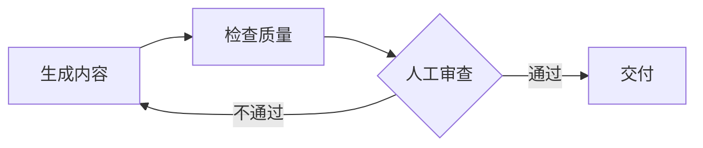

# 资料解决方案系统 — AI Agent 使用指南

> AI Agent：请先阅读本文，了解如何调用系统能力。

---

## 系统概览

| 属性 | 值 |
|------|-----|
| 类型 | 文档开发工具包 |
| 交付形式 | CLI（第一阶段）+ MCP（第二阶段） |
| Python | 3.6+ 兼容 |
| 依赖 | click、pyyaml、jinja2（均已预装） |
| 网络 | 零网络需求 |
| Vale | 可选，内置在 `knowledge/vale.exe` |
| 测试 | 39 个通过（pytest） |

## 工作流程

### 新客户接入


### 日常操作



## CLI 命令参考

### check

对文档运行质量检查。

```bash
doc-solution check --target <路径> [选项]
```

| 选项 | 类型 | 必需 | 默认值 | 说明 |
|------|------|------|--------|------|
| `--target, -t` | string | 是 | - | 文件或目录路径 |
| `--check-type, -c` | enum | 否 | `all` | `all`、`structure`、`format`、`style` |
| `--output, -o` | enum | 否 | `text` | `text`、`json` |
| `--vale-bin` | string | 否 | `vale` | Vale 二进制路径（自动检测内置版本） |
| `--config` | string | 否 | - | Vale .vale.ini 路径 |
| `--save-report` | string | 否 | - | 将 JSON 报告保存到文件 |

**检查类型：**

| 类型 | 需要 Vale | 内置检查 |
|------|-----------|----------|
| `structure` | 否 | 标题层级、必需章节 |
| `format` | 可选 | 段落长度、代码块语言 |
| `style` | 是（可选） | 术语、规范 |
| `all` | 可选 | 以上全部 |

**退出码：** 0 = 无错误，1 = 发现错误

**JSON 输出格式：**

```json
{
  "metadata": {"check_id": "check-...", "check_type": "structure", "target": "./docs/"},
  "summary": {"total": 3, "passed": 0, "failed": 1, "warnings": 2, "score": 70.0},
  "details": [{"rule_id": "heading-level", "severity": "error", "message": "...", "file": "...", "line": 1}],
  "trace": [{"step": "StructureCheck", "tool": "md_parser", "status": "completed"}]
}
```

### generate

从 Jinja2 模板生成文档内容。

```bash
doc-solution generate --template <名称> --params '<json>' [选项]
```

| 选项 | 类型 | 必需 | 默认值 | 说明 |
|------|------|------|--------|------|
| `--template, -t` | string | 是 | - | 模板名称或路径 |
| `--params, -p` | string | 否 | `{}` | JSON 模板参数 |
| `--template-dir` | string | 否 | `knowledge/templates` | 模板目录 |
| `--output, -o` | string | 否 | stdout | 输出文件路径 |
| `--auto-check` | flag | 否 | true | 自动质量检查 |

**模板解析：**
1. 如果 `--template` 是文件路径，直接使用
2. 如果匹配 `--template-dir` 中的目录名，使用目录内的 `.j2` 文件
3. 否则，追加 `.md.j2` 并在 `--template-dir` 中搜索

**内置模板：**

| 名称 | 说明 | 关键参数 |
|------|------|----------|
| `api-ref` | API 参考 | api_name、declaration、parameters[]、return_type、error_codes[] |
| `dev-guide` | 开发指南 | title、overview、prerequisites[]、steps[] |

### build-kb

从客户源材料构建知识库。

```bash
doc-solution build-kb --input <目录> --name <名称> [选项]
```

| 选项 | 类型 | 必需 | 默认值 | 说明 |
|------|------|------|--------|------|
| `--input, -i` | string | 是 | - | 源材料目录 |
| `--name, -n` | string | 是 | - | 客户名称 |
| `--output, -o` | string | 否 | `knowledge` | 输出目录 |
| `--force` | flag | 否 | false | 覆盖现有知识库 |

> **注意：** `build-kb` 命令创建目录结构和索引。关于编写知识库内容（Vale 规则、术语提取、测试标准转换）的完整方法论，请参见 `docs/kb-construction-guide.md`。

**输出结构：**

```
<output>/
  |-- config.yaml                     # 知识库配置
  |-- rules/vale/.vale.ini            # Vale 配置
  |-- rules/vale/styles/              # Vale 风格规则
  |-- rules/custom/                   # 自定义规则模板
  |-- templates/                      # 注册的模板
  |-- glossary/terms.yaml             # 术语文件（初始为空）
  |-- checklist/                      # 检查清单模板
  +-- meta/style-profile.yaml         # 风格分析
```

### test-rule

验证 Vale 规则的正向和负向测试。

```bash
doc-solution test-rule --rule <规则.yml> [选项]
```

| 选项 | 类型 | 必需 | 默认值 | 说明 |
|------|------|------|--------|------|
| `--rule, -r` | string | 是 | - | Vale 规则 YAML 文件路径 |
| `--should-fail` | string | 否 | - | 应触发规则的 .md 文件 |
| `--should-pass` | string | 否 | - | 不应触发规则的 .md 文件 |
| `--output, -o` | enum | 否 | `text` | `text`、`json` |

**退出码：** 0 = 通过，1 = 失败/语法错误

> **注意：** 这是一个通用测试工具。它适用于任何 Vale 规则类型，不关心具体检查内容。参见 `docs/kb-construction-guide.md` 了解完整的测试方法论。

## MCP 工具参考

通过 MCP stdio 服务端（`python -m mcp.server`）提供三个工具：

### quality_check

```json
{
  "name": "quality_check",
  "arguments": {
    "target": "./docs/file.md",
    "check_type": "all"
  }
}
```

返回：JSON 字符串（与 CLI JSON 输出格式相同）

### generate_content

```json
{
  "name": "generate_content",
  "arguments": {
    "template": "api-ref",
    "params": {"api_name": "startAbility"}
  }
}
```

返回：生成的文档文本 + 可选的质量检查

### build_knowledge

```json
{
  "name": "build_knowledge",
  "arguments": {
    "input_dir": "./customer-inputs/",
    "name": "客户名称"
  }
}
```

返回：包含路径和统计信息的构建摘要

## 自我维护检查清单

修改本系统后，请完成以下检查：

- [ ] 运行 `python -m pytest tests/ -v`（全部 39 个必须通过）
- [ ] 更新 `DEVELOPMENT_LOG.md`
- [ ] 如果范围发生变化，更新 `ROADMAP.md`
- [ ] 如果 CLI/MCP API 发生变化，更新本文件（`USAGE.md`）
- [ ] 如果架构发生变化，更新 `docs/` 技术文档
- [ ] 如果构建方法论发生变化，更新 `docs/kb-construction-guide.md`
- [ ] 遵循 Python 3.6 语法规则（不使用 `list[Type]`、`str | None`、含非 ASCII 的 f-string）
- [ ] Windows GBK 安全：不使用 emoji，使用 `%` 格式化
